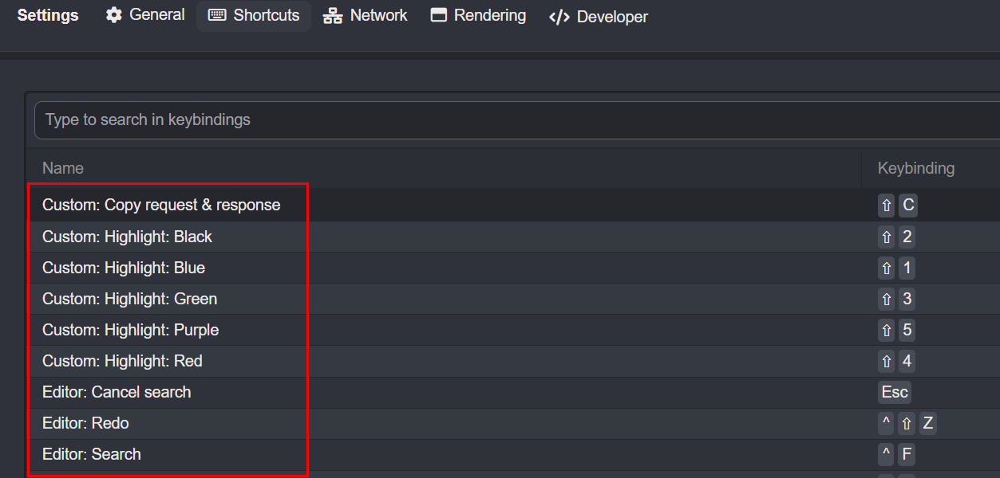
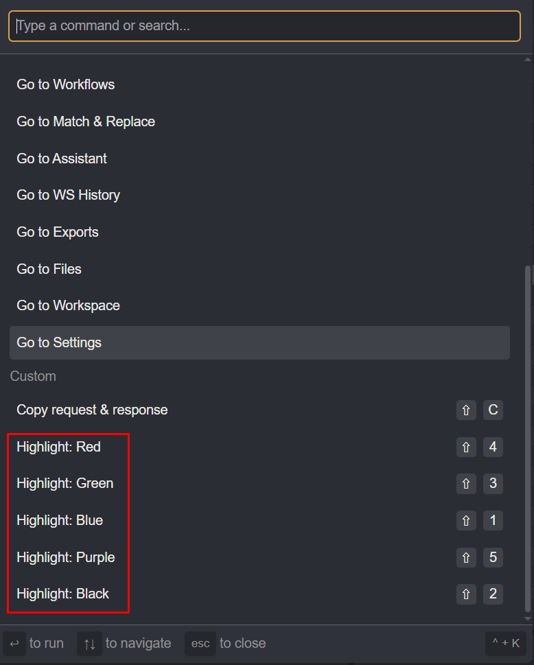
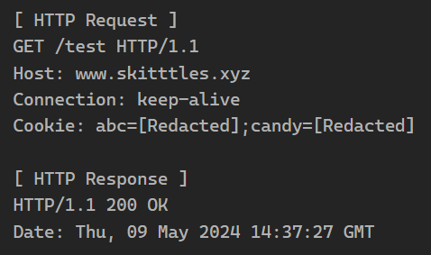

# 👺 Caido plugins
### ✨Apply
Click '**Install package**' in '**Caido > Workspace > Plugins**' and select the '**dist-zip/plugin.zip**' plugin file.

### ⚙ Build
```zsh
pnpm install
pnpm build
```

## Features
### 🎨 Add highlighting shorcuts & commands
- Use the highlighting feature with shortcuts in the HTTP History and Search tabs.
- Add a highlighting shortcut in 'Caido > Settings > Shortcuts' or execute it from the 'Command Palette'.

### 🔖 Add Request/Response Copy Function
- Copy requests and responses using a shortcut in the HTTP History, Search, and Replay tabs.
- Add a copy shortcut in 'Caido > Settings > Shortcuts' or execute it from the 'Command Palette'.
- The HTTP History and Search tabs allow you to copy multiple packets.

## Screenshots
[ Caido > Settings > Shortcuts ]



<br />

[ Caido > Commands ]



<br />

[ Copied request & response ]

